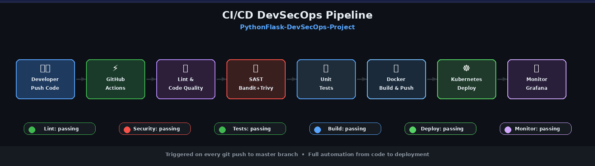
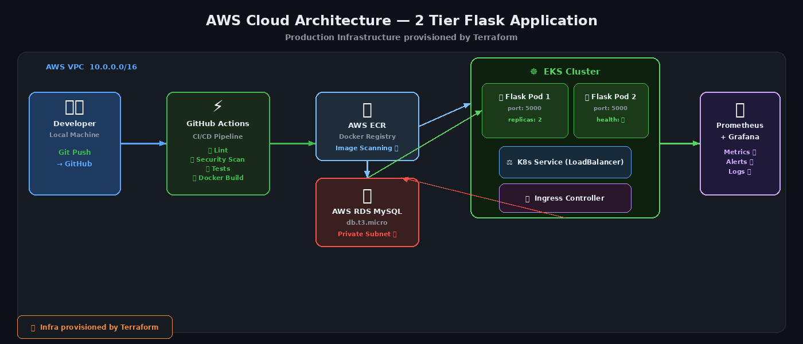
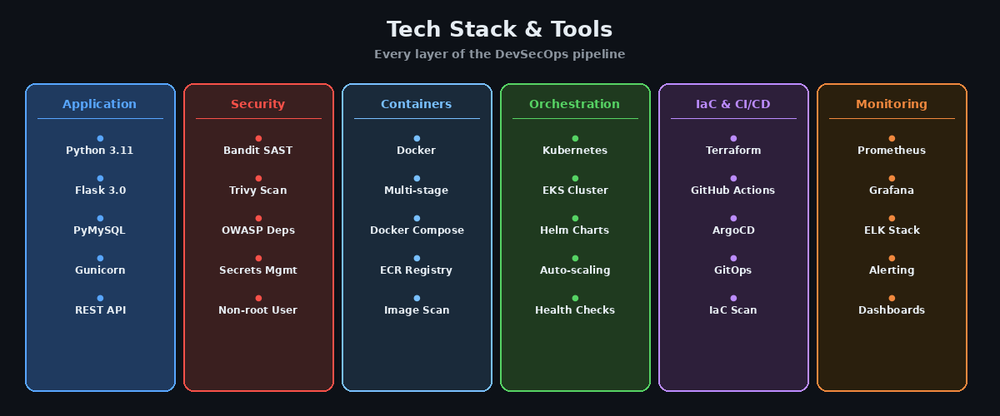
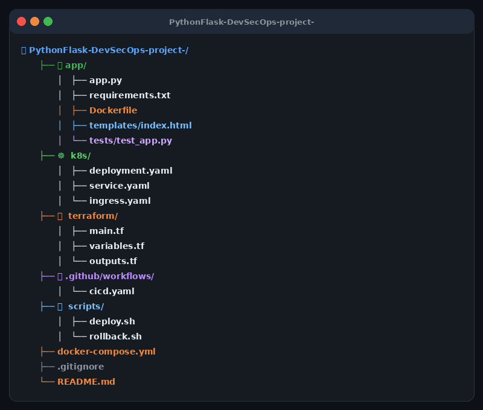

# 🚀 PythonFlask DevSecOps Pipeline

<div align="center">



[](https://github.com/ravikumarpanthangi/PythonFlask-DevSecOps-project-)
[](https://www.docker.com/)
[](https://kubernetes.io/)
[](https://aws.amazon.com/)
[](https://www.terraform.io/)
[](https://www.python.org/)
[](https://flask.palletsprojects.com/)
[](https://www.mysql.com/)

**A production-grade DevSecOps CI/CD pipeline for a 2-Tier Flask web application deployed on AWS**

[Features](#-features) • [Architecture](#-architecture) • [Tech Stack](#-tech-stack) • [Quick Start](#-quick-start) • [Pipeline](#-cicd-pipeline) • [Security](#-security)

</div>

---

## 📌 Project Overview

This project demonstrates a **complete end-to-end DevSecOps pipeline** for a 2-Tier Flask application. Every commit triggers an automated pipeline that tests, scans, builds, and deploys the application to a Kubernetes cluster on AWS — with **security checks at every stage**.

> 💡 Built to showcase real-world DevSecOps skills including containerization, infrastructure as code, CI/CD automation, and cloud deployment.

---

## ✨ Features

- ✅ **REST API** — Full CRUD operations with Flask & MySQL
- ✅ **Containerized** — Multi-stage Docker build with non-root user
- ✅ **2-Tier Architecture** — Flask app + MySQL database
- ✅ **CI/CD Pipeline** — Fully automated with GitHub Actions
- ✅ **Security Scanning** — SAST with Bandit, image scan with Trivy
- ✅ **Infrastructure as Code** — AWS resources provisioned with Terraform
- ✅ **Kubernetes Deployment** — EKS with auto-scaling and health checks
- ✅ **Monitoring** — Prometheus metrics + Grafana dashboards
- ✅ **Zero Hardcoded Secrets** — All credentials via environment variables

---

## 🏗️ Architecture



### How It Works

```
Developer pushes code
        ↓
GitHub Actions triggered automatically
        ↓
Code Quality → Security Scan → Unit Tests
        ↓
Docker Image built & pushed to AWS ECR
        ↓
Kubernetes pulls image → deploys to EKS
        ↓
Flask app running with 2 replicas
        ↓
Prometheus + Grafana monitoring
```

---

## 🛠️ Tech Stack



| Layer | Technology |
|---|---|
| **Language** | Python 3.11 |
| **Framework** | Flask 3.0 |
| **Database** | MySQL 8.0 / AWS RDS |
| **Container** | Docker (multi-stage build) |
| **Orchestration** | Kubernetes (AWS EKS) |
| **CI/CD** | GitHub Actions |
| **IaC** | Terraform |
| **Registry** | AWS ECR / Docker Hub |
| **SAST** | Bandit |
| **Image Scan** | Trivy |
| **Monitoring** | Prometheus + Grafana |
| **Web Server** | Gunicorn |

---

## 📁 Project Structure



```
PythonFlask-DevSecOps-project-/
│
├── 📱 app/                         # Flask Application (Tier 1)
│   ├── app.py                      # REST API - CRUD endpoints
│   ├── requirements.txt            # Python dependencies
│   ├── Dockerfile                  # Multi-stage container build
│   ├── templates/
│   │   └── index.html              # Dark theme UI
│   └── tests/
│       └── test_app.py             # Unit tests with pytest
│
├── ☸️  k8s/                         # Kubernetes Manifests
│   ├── deployment.yaml             # 2 replicas + health checks
│   ├── service.yaml                # LoadBalancer service
│   └── ingress.yaml                # Ingress controller
│
├── 🏗️  terraform/                   # Infrastructure as Code
│   ├── main.tf                     # VPC, EKS, ECR, RDS
│   ├── variables.tf                # Input variables
│   └── outputs.tf                  # Output values
│
├── 🔄 .github/workflows/
│   └── cicd.yaml                   # Full CI/CD pipeline
│
├── 🛠️  scripts/
│   ├── deploy.sh                   # Deploy script
│   └── rollback.sh                 # Rollback script
│
├── docker-compose.yml              # Local development setup
├── .gitignore                      # Excludes secrets & venv
└── README.md                       # You are here!
```

---

## ⚡ Quick Start

### Prerequisites

```bash
git --version        # Git 2.x+
python3 --version    # Python 3.11+
docker --version     # Docker 24.x+
kubectl version      # Kubernetes CLI
terraform --version  # Terraform 1.x+
aws --version        # AWS CLI v2
```

### 1. Clone the Repository

```bash
git clone https://github.com/ravikumarpanthangi/PythonFlask-DevSecOps-project-.git
cd PythonFlask-DevSecOps-project-
```

### 2. Setup Environment Variables

```bash
# Create .env file (never commit this!)
cat > app/.env << EOF
DB_HOST=localhost
DB_PORT=3306
DB_NAME=flaskdb
DB_USER=flaskuser
DB_PASSWORD=your_password
EOF
```

### 3. Run Locally with Docker Compose

```bash
# Start all services (Flask + MySQL)
docker compose up -d

# Check running containers
docker compose ps

# Visit the app
open http://localhost:5000
```

### 4. Test the API

```bash
# Health check
curl http://localhost:5000/health

# Create a user
curl -X POST http://localhost:5000/users \
  -H "Content-Type: application/json" \
  -d '{"name":"Ravi Kumar","email":"ravi@example.com"}'

# Get all users
curl http://localhost:5000/users

# Delete a user
curl -X DELETE http://localhost:5000/users/1
```

---

## 🔄 CI/CD Pipeline

Every `git push` to `master` triggers the full pipeline:

```
┌─────────────┐    ┌──────────────┐    ┌─────────────┐
│  1. Lint    │───▶│ 2. Security  │───▶│  3. Tests   │
│  flake8     │    │  Bandit+Trivy│    │  pytest+cov │
│  pylint     │    │  SAST Scan   │    │  MySQL svc  │
└─────────────┘    └──────────────┘    └─────────────┘
                                               │
                                               ▼
┌─────────────┐    ┌──────────────┐    ┌─────────────┐
│  6. Notify  │◀───│  5. Deploy   │◀───│  4. Build   │
│  Summary    │    │  Kubernetes  │    │  Docker+ECR │
│  All Jobs   │    │  EKS Cluster │    │  Trivy Scan │
└─────────────┘    └──────────────┘    └─────────────┘
```

### GitHub Secrets Required

| Secret | Description |
|---|---|
| `DOCKERHUB_USERNAME` | Docker Hub username |
| `DOCKERHUB_TOKEN` | Docker Hub access token |
| `MYSQL_ROOT_PASSWORD` | MySQL root password |
| `MYSQL_DATABASE` | Database name |
| `MYSQL_USER` | Database user |
| `MYSQL_PASSWORD` | Database password |
| `KUBECONFIG` | Base64 encoded kubeconfig |
| `DB_HOST` | Database host |
| `DB_PORT` | Database port |

---

## 🔐 Security

Security is built into **every stage** of the pipeline:

| Stage | Tool | What it Checks |
|---|---|---|
| **Code** | Bandit | Python security vulnerabilities |
| **Dependencies** | Safety | Known CVEs in packages |
| **Container** | Trivy | OS & library vulnerabilities |
| **IaC** | Checkov | Terraform misconfigurations |
| **Runtime** | Falco | Runtime threat detection |
| **Secrets** | .gitignore | No credentials in code |

### Security Best Practices Applied

- ✅ Non-root user in Docker container
- ✅ Multi-stage Docker build (smaller attack surface)
- ✅ All secrets via environment variables
- ✅ Kubernetes Secrets for sensitive data
- ✅ Private subnets for RDS database
- ✅ Security groups with least privilege

---

## ☸️ Kubernetes Deployment

```bash
# Create secrets (never hardcode!)
kubectl create secret generic flask-secret \
  --from-literal=DB_HOST=mysql-db \
  --from-literal=DB_NAME=flaskdb \
  --from-literal=DB_USER=flaskuser \
  --from-literal=DB_PASSWORD=your_password

# Deploy application
kubectl apply -f k8s/

# Check status
kubectl get pods -l app=flask-app
kubectl get svc flask-app

# Check logs
kubectl logs -l app=flask-app
```

---

## 🏗️ Infrastructure (Terraform)

```bash
cd terraform/

# Initialize
terraform init

# Plan (preview changes)
terraform plan \
  -var="db_username=flaskuser" \
  -var="db_password=your_password"

# Apply (create infrastructure)
terraform apply \
  -var="db_username=flaskuser" \
  -var="db_password=your_password"

# Configure kubectl
aws eks update-kubeconfig \
  --region us-east-1 \
  --name flask-devsecops-cluster

# Destroy when done
terraform destroy
```

### Resources Created

| Resource | Purpose |
|---|---|
| VPC + Subnets | Network isolation |
| EKS Cluster | Kubernetes control plane |
| EKS Node Group | Worker nodes (t3.medium) |
| AWS ECR | Docker image registry |
| RDS MySQL | Production database (private subnet) |
| Security Groups | Firewall rules |
| IAM Roles | Least privilege access |

---

## 📊 Monitoring

```bash
# Install Prometheus + Grafana
helm repo add prometheus-community \
  https://prometheus-community.github.io/helm-charts

helm install monitoring \
  prometheus-community/kube-prometheus-stack

# Access Grafana dashboard
kubectl port-forward svc/monitoring-grafana 3000:80

# Visit: http://localhost:3000
# Username: admin
# Password: prom-operator
```

### Key Metrics

| Metric | Description |
|---|---|
| `flask_http_requests_total` | Total API requests |
| `flask_http_request_duration_seconds` | Response time |
| `container_cpu_usage_seconds_total` | CPU usage per pod |
| `container_memory_usage_bytes` | Memory per pod |

---

## 🧪 Running Tests

```bash
cd app/

# Install test dependencies
pip install pytest pytest-cov

# Run tests
pytest tests/ -v

# Run with coverage
pytest tests/ -v --cov=app --cov-report=html

# Security scan
bandit -r . -f json
```

---

## 📝 API Reference

| Method | Endpoint | Description |
|---|---|---|
| `GET` | `/` | Home page UI |
| `GET` | `/health` | Health check |
| `GET` | `/users` | Get all users |
| `POST` | `/users` | Create new user |
| `DELETE` | `/users/<id>` | Delete user by ID |

### Example Requests

```bash
# Create user
curl -X POST http://localhost:5000/users \
  -H "Content-Type: application/json" \
  -d '{"name": "Ravi Kumar", "email": "ravi@example.com"}'

# Response
{"message": "User created successfully!"}

# Get users
curl http://localhost:5000/users

# Response
[{"id": 1, "name": "Ravi Kumar", "email": "ravi@example.com", "created": "2026-03-05"}]
```

---

## 🤝 Contributing

1. Fork the repository
2. Create your feature branch (`git checkout -b feature/amazing-feature`)
3. Commit your changes (`git commit -m 'feat: add amazing feature'`)
4. Push to the branch (`git push origin feature/amazing-feature`)
5. Open a Pull Request

---

## 👨‍💻 Author

**Ravi Kumar Panthangi**

[](https://github.com/ravikumarpanthangi)

---

## 📄 License

This project is licensed under the MIT License.

---

<div align="center">

⭐ **Star this repo if it helped you learn DevSecOps!** ⭐

*Built with ❤️ — Flask + Docker + Kubernetes + AWS + Terraform + GitHub Actions*

</div>
